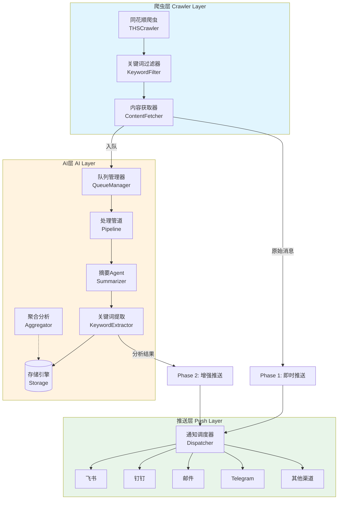
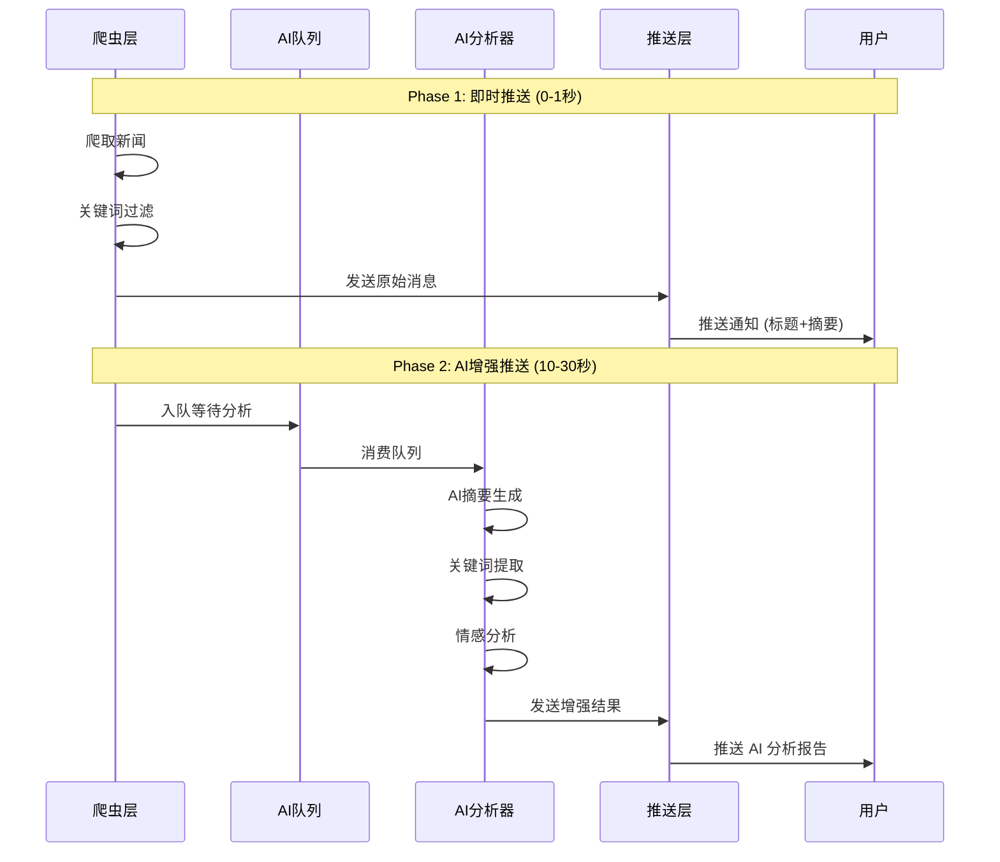
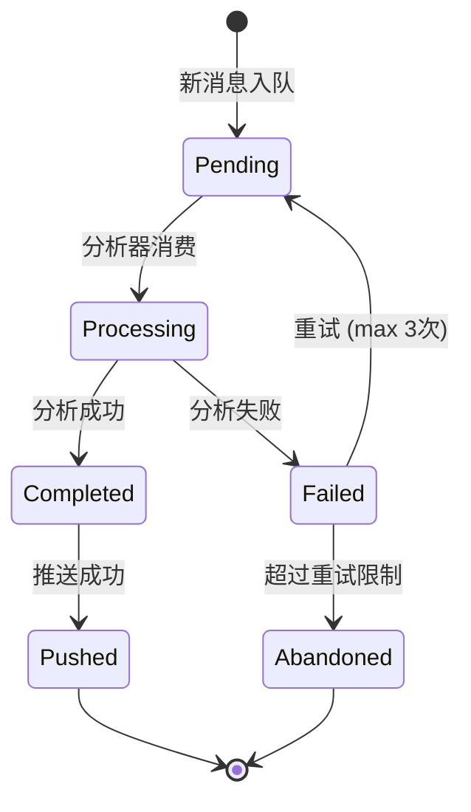
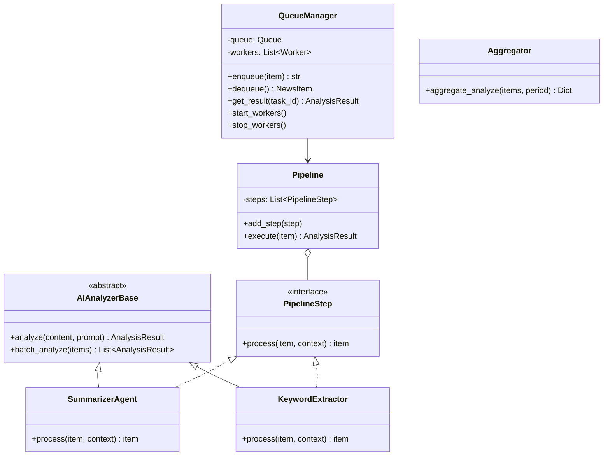
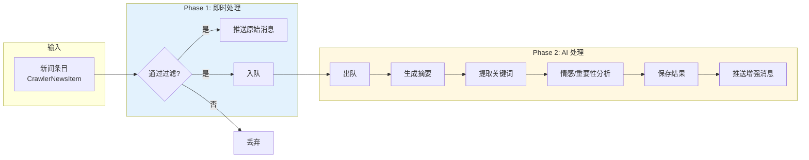
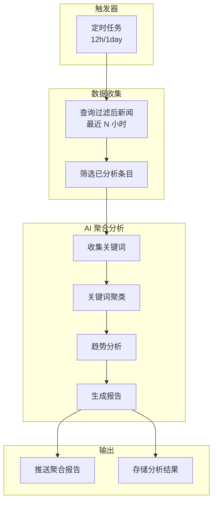
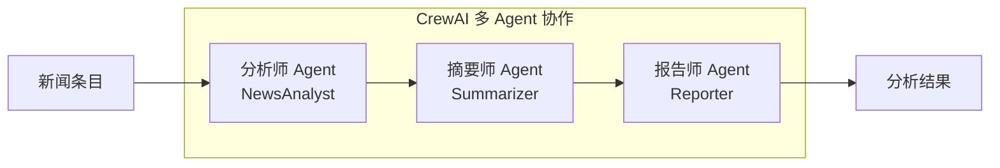
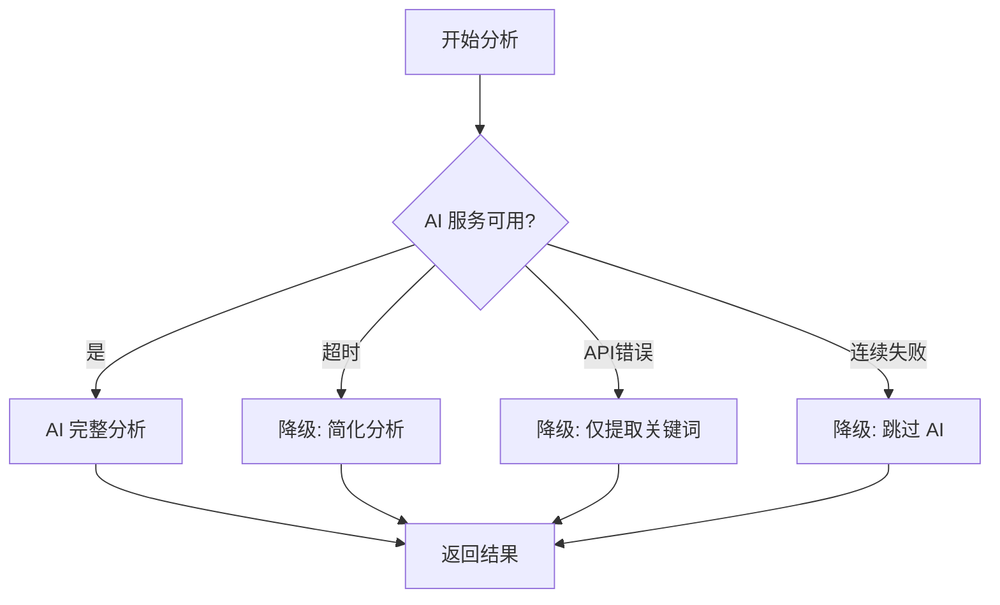
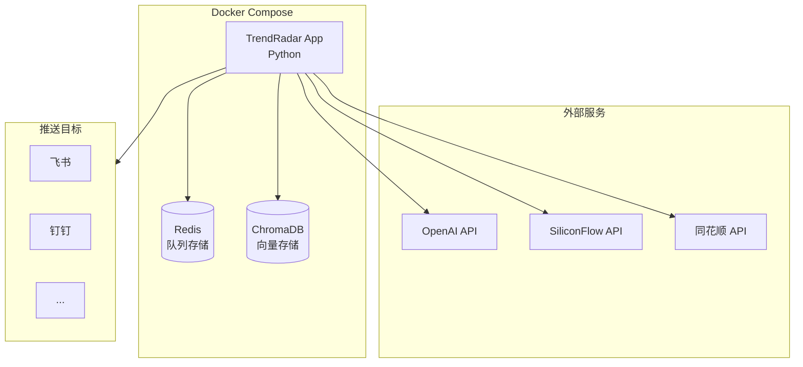

# TrendRadar AI 系统架构设计

> 版本：v1.0
> 日期：2026-01-30
> 状态：设计阶段

---

## 一、整体架构概览

### 1.1 三层架构图

```
┌─────────────────────────────────────────────────────────────────────────────┐
│                                                                               │
│                           推送层 (Push Layer)                                 │
│                                                                               │
│   ┌──────────────────────────────────────────────────────────────────────┐   │
│   │                    NotificationDispatcher                             │   │
│   │                                                                        │   │
│   │   ┌─────────┐  ┌─────────┐  ┌─────────┐  ┌─────────┐  ┌─────────┐   │   │
│   │   │  飞书   │  │  钉钉   │  │  邮件   │  │ Telegram│  │  其他   │   │   │
│   │   └─────────┘  └─────────┘  └─────────┘  └─────────┘  └─────────┘   │   │
│   └──────────────────────────────────────────────────────────────────────┘   │
│                                                                               │
└───────────────────────────────────┬───────────────────────────────────────────┘
                                    │
                          ┌─────────┴─────────┐
                          │ 原始消息   分析结果 │
                          │ (Phase 1) (Phase 2)│
                          └─────────┬─────────┘
                                    │
┌───────────────────────────────────┴───────────────────────────────────────────┐
│                                                                               │
│                            AI 层 (AI Layer)                                   │
│                                                                               │
│   ┌──────────────────────────────────────────────────────────────────────┐   │
│   │                                                                        │   │
│   │  ┌─────────────┐     ┌─────────────────────┐     ┌─────────────┐     │   │
│   │  │    Queue    │────▶│   Pipeline Engine   │────▶│   Storage   │     │   │
│   │  │   Manager   │     │                     │     │   Engine    │     │   │
│   │  │             │     │  ┌───────────────┐  │     │             │     │   │
│   │  │ - enqueue() │     │  │  Summarizer   │  │     │ - SQLite    │     │   │
│   │  │ - dequeue() │     │  │     Agent     │  │     │ - VectorDB  │     │   │
│   │  │ - status()  │     │  └───────┬───────┘  │     │   (预留)    │     │   │
│   │  │             │     │          │          │     │             │     │   │
│   │  └─────────────┘     │  ┌───────▼───────┐  │     └─────────────┘     │   │
│   │                      │  │   Keyword     │  │                         │   │
│   │                      │  │   Extractor   │  │                         │   │
│   │                      │  └───────┬───────┘  │                         │   │
│   │                      │          │          │                         │   │
│   │                      │  ┌───────▼───────┐  │                         │   │
│   │                      │  │  Aggregator   │  │                         │   │
│   │                      │  │   (定时)      │  │                         │   │
│   │                      │  └───────────────┘  │                         │   │
│   │                      └─────────────────────┘                         │   │
│   │                                                                        │   │
│   └──────────────────────────────────────────────────────────────────────┘   │
│                                                                               │
└───────────────────────────────────┬───────────────────────────────────────────┘
                                    │
                          ┌─────────┴─────────┐
                          │   过滤后的新闻     │
                          └─────────┬─────────┘
                                    │
┌───────────────────────────────────┴───────────────────────────────────────────┐
│                                                                               │
│                          爬虫层 (Crawler Layer)                               │
│                                                                               │
│   ┌──────────────────────────────────────────────────────────────────────┐   │
│   │                         CrawlerRunner                                  │   │
│   │                                                                        │   │
│   │   ┌─────────────┐     ┌─────────────┐     ┌─────────────┐            │   │
│   │   │ THSCrawler  │────▶│   Filter    │────▶│  Content    │            │   │
│   │   │ (同花顺7x24)│     │  (关键词)   │     │  Fetcher    │            │   │
│   │   └─────────────┘     └─────────────┘     └─────────────┘            │   │
│   │                                                                        │   │
│   └──────────────────────────────────────────────────────────────────────┘   │
│                                                                               │
└─────────────────────────────────────────────────────────────────────────────┘
```

### 1.2 数据流图 (Mermaid)



---

## 二、两阶段推送流程

### 2.1 流程说明



### 2.2 状态机



---

## 三、AI 层详细设计

### 3.1 模块结构

```
trendradar/
└── ai/
    ├── __init__.py
    ├── base.py              # 基类定义
    ├── config.py            # AI 配置
    ├── queue_manager.py     # 队列管理
    ├── pipeline.py          # 处理管道
    ├── storage.py           # 存储引擎
    │
    ├── analyzers/           # 分析器
    │   ├── __init__.py
    │   ├── summarizer.py    # 摘要生成
    │   ├── keywords.py      # 关键词提取
    │   ├── sentiment.py     # 情感分析
    │   └── aggregator.py    # 聚合分析
    │
    ├── agents/              # Agent 实现
    │   ├── __init__.py
    │   ├── crewai_agent.py  # CrewAI 实现
    │   ├── langchain_agent.py # LangChain 实现
    │   └── simple_agent.py  # 简单 LLM 调用
    │
    ├── prompts/             # Prompt 模板
    │   ├── summarize.txt
    │   ├── keywords.txt
    │   └── aggregate.txt
    │
    └── vectordb/            # 向量数据库 (预留)
        ├── __init__.py
        ├── chroma.py
        └── pinecone.py
```

### 3.2 核心接口



### 3.3 配置结构

```yaml
# config.yaml

AI:
  # 总开关
  ENABLED: true

  # LLM 配置
  LLM:
    PROVIDER: "openai"        # openai, anthropic, siliconflow, ollama
    MODEL: "gpt-4o-mini"
    API_KEY: "${OPENAI_API_KEY}"
    BASE_URL: ""              # 自定义 API 地址 (SiliconFlow 等)
    TIMEOUT: 30
    MAX_RETRIES: 3

  # Agent 框架选择
  FRAMEWORK: "crewai"         # crewai, langchain, simple

  # 队列配置
  QUEUE:
    ENABLED: true
    TYPE: "memory"            # memory, redis (预留)
    MAX_SIZE: 100
    WORKERS: 2
    RETRY_COUNT: 3
    RETRY_DELAY: 5            # 秒

  # Pipeline 配置
  PIPELINE:
    STEPS:
      - summarizer
      - keywords
      # - sentiment          # 可选

  # 向量数据库 (预留)
  VECTOR_DB:
    ENABLED: false
    TYPE: "chroma"            # chroma, pinecone, milvus
    PATH: "output/vectordb"
    COLLECTION: "news"

  # Prompt 配置
  PROMPTS:
    DIR: "prompts"
    SUMMARIZE: "summarize.txt"
    KEYWORDS: "keywords.txt"
    AGGREGATE: "aggregate.txt"

  # 聚合分析配置
  AGGREGATION:
    ENABLED: true
    SCHEDULE: "0 8,20 * * *"  # Cron 表达式
    PERIOD: "12h"             # 分析周期
    MIN_ITEMS: 5              # 最少条目数

  # 两阶段推送
  TWO_PHASE_PUSH:
    ENABLED: true
    PHASE1_IMMEDIATE: true    # 立即推送原始消息
    PHASE2_ENHANCED: true     # AI 分析后推送增强版
```

---

## 四、数据流详解

### 4.1 单条新闻处理流程



### 4.2 聚合分析流程



---

## 五、接口定义

### 5.1 爬虫层 → AI 层

```python
@dataclass
class NewsItemForAI:
    """传递给 AI 层的新闻数据"""
    id: str                    # 唯一标识
    title: str                 # 标题
    content: str               # 内容（摘要或全文）
    full_content: str          # 完整内容
    url: str                   # 原文链接
    published_at: str          # 发布时间
    source: str                # 来源
    matched_keywords: List[str] # 匹配的过滤关键词
    extra: Dict[str, Any]      # 扩展字段
```

### 5.2 AI 层 → 推送层

```python
@dataclass
class AIEnhancedNews:
    """AI 增强后的新闻数据"""
    original: NewsItemForAI    # 原始数据
    summary: str               # AI 生成的摘要
    keywords: List[str]        # 提取的关键词
    sentiment: str             # 情感: positive/negative/neutral
    importance: int            # 重要性: 1-5
    category: str              # 分类
    analyzed_at: str           # 分析时间
    model_used: str            # 使用的模型
```

### 5.3 队列接口

```python
class AIQueueInterface(Protocol):
    """AI 队列接口"""

    async def enqueue(
        self,
        item: NewsItemForAI,
        priority: int = 0
    ) -> str:
        """入队，返回任务ID"""
        ...

    async def get_status(self, task_id: str) -> TaskStatus:
        """获取任务状态"""
        ...

    async def get_result(
        self,
        task_id: str,
        timeout: float = 30.0
    ) -> Optional[AIEnhancedNews]:
        """获取分析结果"""
        ...

    async def cancel(self, task_id: str) -> bool:
        """取消任务"""
        ...

class TaskStatus(Enum):
    PENDING = "pending"
    PROCESSING = "processing"
    COMPLETED = "completed"
    FAILED = "failed"
    CANCELLED = "cancelled"
```

---

## 六、推荐框架接入方案

### 6.1 方案 A: CrewAI (推荐)



**代码示例**:

```python
from crewai import Agent, Task, Crew
from langchain_openai import ChatOpenAI

class NewsAnalysisCrew:
    def __init__(self, config):
        self.llm = ChatOpenAI(
            model=config["model"],
            api_key=config["api_key"]
        )

        # 定义 Agent
        self.analyst = Agent(
            role="财经新闻分析师",
            goal="深入分析财经新闻，提取关键信息",
            backstory="你是资深财经记者，擅长快速把握新闻要点",
            llm=self.llm
        )

        self.summarizer = Agent(
            role="摘要撰写专家",
            goal="将分析结果转化为简洁摘要",
            backstory="你擅长用精炼的语言总结复杂信息",
            llm=self.llm
        )

    def analyze(self, news_item: NewsItemForAI) -> AIEnhancedNews:
        # 定义任务
        analyze_task = Task(
            description=f"分析以下新闻:\n{news_item.content}",
            agent=self.analyst,
            expected_output="关键信息列表、情感倾向、重要性评分"
        )

        summarize_task = Task(
            description="基于分析结果生成50字以内的摘要",
            agent=self.summarizer,
            expected_output="简洁摘要"
        )

        # 执行
        crew = Crew(
            agents=[self.analyst, self.summarizer],
            tasks=[analyze_task, summarize_task]
        )
        result = crew.kickoff()

        return self._parse_result(news_item, result)
```

### 6.2 方案 B: 简单 LLM 调用

```python
import openai
from typing import Optional

class SimpleLLMAnalyzer:
    """简单的 LLM 直调分析器"""

    def __init__(self, config: dict):
        self.client = openai.AsyncOpenAI(
            api_key=config["api_key"],
            base_url=config.get("base_url")
        )
        self.model = config["model"]
        self.prompts = self._load_prompts(config["prompts_dir"])

    async def analyze(
        self,
        news_item: NewsItemForAI,
        prompt_file: Optional[str] = None
    ) -> AIEnhancedNews:
        prompt = self.prompts.get(prompt_file, self.prompts["default"])

        response = await self.client.chat.completions.create(
            model=self.model,
            messages=[
                {"role": "system", "content": prompt},
                {"role": "user", "content": self._format_news(news_item)}
            ],
            temperature=0.3
        )

        return self._parse_response(news_item, response)
```

---

## 七、降级与容错

### 7.1 降级策略



### 7.2 熔断器模式

```python
class CircuitBreaker:
    """熔断器"""

    def __init__(
        self,
        failure_threshold: int = 5,
        recovery_timeout: int = 60
    ):
        self.failure_count = 0
        self.failure_threshold = failure_threshold
        self.recovery_timeout = recovery_timeout
        self.last_failure_time = None
        self.state = "CLOSED"  # CLOSED, OPEN, HALF_OPEN

    async def call(self, func, *args, **kwargs):
        if self.state == "OPEN":
            if self._should_try_recover():
                self.state = "HALF_OPEN"
            else:
                raise CircuitBreakerOpen()

        try:
            result = await func(*args, **kwargs)
            self._on_success()
            return result
        except Exception as e:
            self._on_failure()
            raise
```

---

## 八、部署架构

### 8.1 Docker 部署



### 8.2 docker-compose.yaml

```yaml
version: '3.8'

services:
  trendradar:
    build: .
    container_name: trendradar
    environment:
      - OPENAI_API_KEY=${OPENAI_API_KEY}
      - SILICONFLOW_API_KEY=${SILICONFLOW_API_KEY}
    volumes:
      - ./config.yaml:/app/config.yaml
      - ./output:/app/output
      - ./prompts:/app/prompts
    depends_on:
      - redis
      - chromadb
    restart: unless-stopped

  redis:
    image: redis:7-alpine
    container_name: trendradar-redis
    volumes:
      - redis_data:/data
    restart: unless-stopped

  chromadb:
    image: chromadb/chroma:latest
    container_name: trendradar-chromadb
    volumes:
      - chroma_data:/chroma/chroma
    restart: unless-stopped

volumes:
  redis_data:
  chroma_data:
```

---

## 九、实施计划

| 阶段 | 目标 | 产出 |
|------|------|------|
| Phase 1 | 基础架构 | 三层接口定义，简单 LLM 分析器，内存队列 |
| Phase 2 | Agent 集成 | CrewAI 多 Agent，摘要/关键词提取 |
| Phase 3 | 高级功能 | 向量数据库，聚合分析，两阶段推送 |
| Phase 4 | 生产优化 | 监控、日志、错误处理、Docker 部署 |

---

## 十、附录

### A. 术语表

| 术语 | 说明 |
|------|------|
| Agent | AI 代理，具有特定角色和能力的 LLM 封装 |
| Pipeline | 处理管道，多个步骤串联执行 |
| RAG | 检索增强生成，结合向量检索的 LLM 应用 |
| Two-Phase Push | 两阶段推送，先推原始消息，再推 AI 分析结果 |

### B. 参考链接

- [CrewAI 文档](https://docs.crewai.com/)
- [LangChain 文档](https://python.langchain.com/)
- [LlamaIndex 文档](https://docs.llamaindex.ai/)
- [OpenAI API](https://platform.openai.com/docs/)
